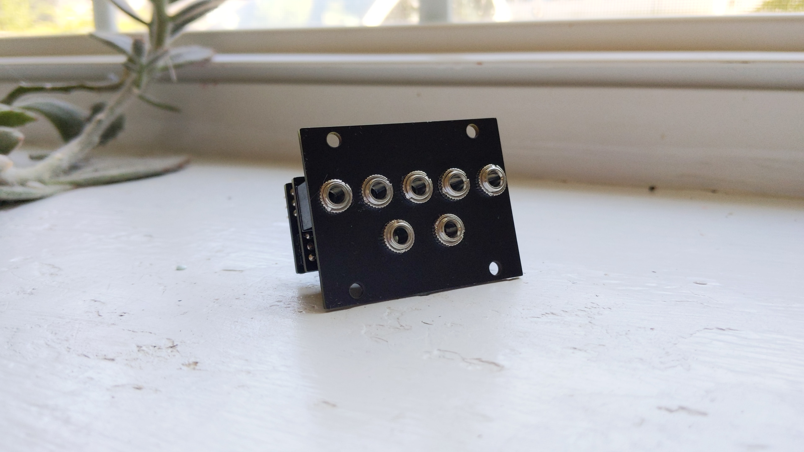

# Nearless (Nearness 1U Rework)

This is a small Intellijel 1U rework of Nearness designed by [*Jesper Särnesjö*](https://github.com/sarnesjo/nearness).

Minimal panning mixer for the Eurorack modular synthesizer system. Five inputs, two outputs. The closer an input is to either side, the greater its panning in that direction. 10hp.

Nearness is a product of the [*llllllll*](https://llllllll.co/t/prototyping-nearness-a-minimal-panning-mixer-module/8330) community.

## CHANGES

The module has been redesigned to fit an Intellijel 1U in 10hp, so there are two fewer inputs. Why 10hp? That's all I had free! :)

The resistor values have been simplified to accomodate the simple stereo spread. I tried to leave everything else as I found it.

## PCBS AND PANEL

The [kicad](kicad) directory contains the schematic and PCB and panel layouts as KiCad 5 projects.

Gerber files for fabrication are available in the [gerbers](gerbers) directory. 

Here is the [BOM](nearless_BOM.csv).

## IMPORTANT

1. I fabricated a working 0603 vesion of this module but decided to update the footprints to 0805 components before sharing (in kindness to others with bad vision). I have not built the 0805 version personally, but it should be fine. Thanks in advance to anyone willing to look over things/give it a try. Let me know how it goes.
2. On the bottom PCB the jumper pins and power header are on the backside, and the components and pin headers to connect boards are on the top. See [rear pic](doc/rear.jpg) to clarify.

## License

[CC BY-SA 4.0](http://creativecommons.org/licenses/by-sa/4.0/)
